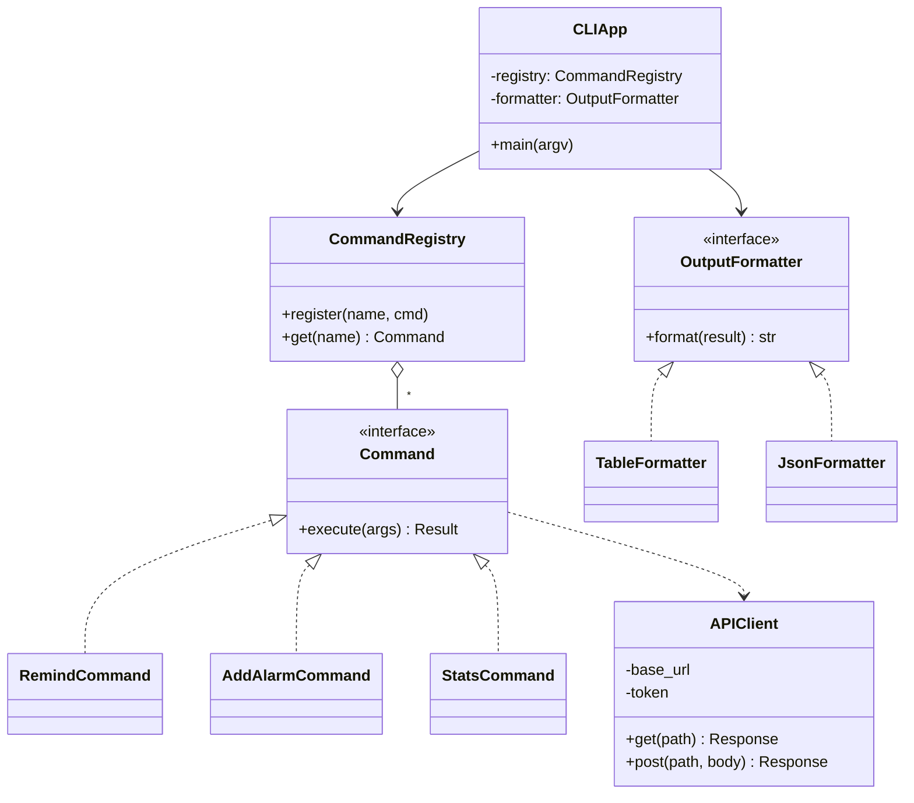
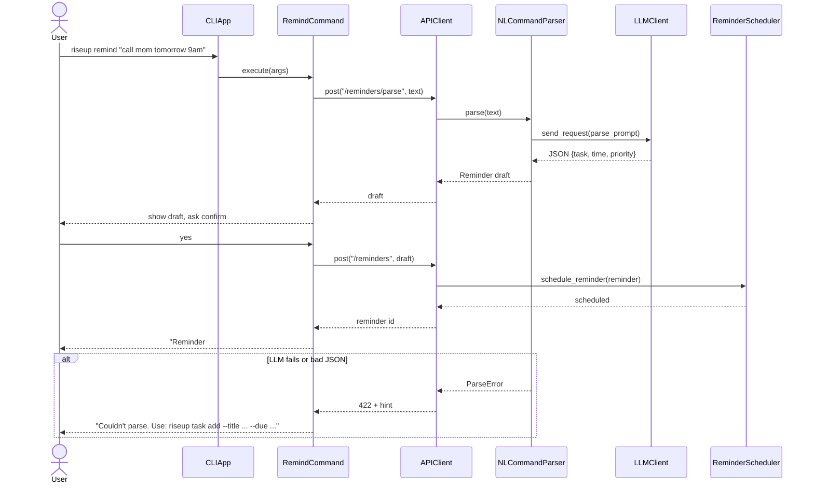

# RiseUp - Feature Specification & CLI Design

This document replaces the 5 feature groups in `project-scope.md` with **14 distinct features**, each specified with the 8 fields required by the Stage 1 instructions. It also adds the **CLI** (required by the instructions) as a second interface to the same system.

Conventions:
- **Type:** Deterministic / AI / Hybrid (AI decides, deterministic code validates and executes, per AD-02).
- **GUI:** React web app. **CLI:** `riseup` command (see Section 3).
- Class names follow `feature-to-design-mapping.md`. **New classes** introduced here are marked **(new)**.

---

## 1. Feature Summary

| ID | Feature | Type | Use Case |
|----|---------|------|----------|
| F01 | Alarm Management | Deterministic | UC-01 |
| F02 | Verification Challenge | Deterministic | UC-02 |
| F03 | Post-Wake Check-in | Deterministic | UC-02 |
| F04 | AI Escalation Decision | AI (Hybrid with fallback) | UC-03 |
| F05 | Multi-Channel Escalation Execution | Deterministic | UC-03 |
| F06 | Emergency Contact & Escalation Preferences | Deterministic | UC-08 (new) |
| F07 | Natural-Language Reminder Creation | Hybrid | UC-04 |
| F08 | Reminder Management | Deterministic | UC-04, UC-06 (new) |
| F09 | AI Reminder Prioritization | AI (Hybrid with fallback) | UC-05 |
| F10 | Reminder Escalation Levels | Deterministic | UC-05 |
| F11 | Behavioral Learning & Profile Update | Deterministic | UC-03, UC-05 |
| F12 | Sleep & Completion Analytics Dashboard | Deterministic | UC-07 (new) |
| F13 | AI Personalized Recommendations | AI | UC-07 (new) |
| F14 | History & Decision Explanation | Hybrid | UC-09 (new) |

Not counted as features (per the instructions): login/logout, settings screens, "web app" itself, scheduler infrastructure.

---

## 2. Detailed Feature Specifications

### F01 - Alarm Management
- **Description:** Create, edit, enable/disable, and delete alarms with time, label, sound, vibration intensity, repeat pattern, snooze setting, and verification task type. Limit of 20 alarms per user.
- **User Interaction (GUI):** Dashboard → "New Alarm" → alarm form → "Save Alarm". Existing alarms show a toggle, Edit, and Delete button.
- **CLI:** `riseup alarm add|list|edit|delete|toggle`
- **Input:** time (HH:MM), label, sound, vibration level, repeat pattern, snooze on/off, verification task type.
- **Output:** persisted `Alarm`, scheduled trigger job, confirmation "Alarm set for 07:00".
- **AI Involvement:** None (deterministic).
- **Expected Workflow:** UI/CLI → `AlarmController.create_alarm()` → `Alarm.validate()` → `AlarmRepository.save()` → `AlarmScheduler.schedule_alarm()` → confirmation returned.
- **Error/Alternative Cases:** invalid time format (inline error); 20-alarm limit reached (prompt to delete one); DB failure (retry message, nothing scheduled); user cancels (no data saved); edit of a running alarm (rejected until it finishes).
- **Main classes:** `Alarm`, `AlarmScheduler`, `AlarmRepository` **(new)**, `UserPreferences`.

### F02 - Verification Challenge
- **Description:** When an alarm fires, it cannot be dismissed until the user completes a challenge: photo object detection, math puzzle, trivia, or custom task. Wrong attempts reset the challenge; repeated camera failure falls back to a math puzzle.
- **User Interaction (GUI):** Full-screen alarm page with disabled Dismiss button and a task panel (camera, answer field, or "Mark completed").
- **CLI:** `riseup alarm verify <alarm-id> --answer 42` (math/trivia/custom). Photo verification is GUI-only (needs camera); the CLI reports this clearly.
- **Input:** task answer, photo, or completion confirmation.
- **Output:** pass/fail result; on pass, alarm stops and completion time is logged.
- **AI Involvement:** None. Photo check uses a vision library and answers are validated deterministically (AD-02).
- **Expected Workflow:** `AlarmScheduler.trigger_alarm()` → `Alarm.trigger()` → `VerificationTaskFactory.create()` **(new)** → task shown → `VerificationTask.validate(response)` → on success `Alarm.stop()` and `CheckIn` scheduled.
- **Error/Alternative Cases:** wrong answer (retry, alarm keeps ringing); blurry photo (retry); camera unavailable (fallback to `MathTask`); user tries to close page (blocked); snooze pressed (allowed up to 3 times if enabled); no response for 2 min (hand over to F04).
- **Main classes:** `VerificationTask` (abstract), `ObjectDetectionTask`, `MathTask`, `TriviaTask`, `CustomTask`, `VerificationTaskFactory` **(new)**.

### F03 - Post-Wake Check-in
- **Description:** 5-10 minutes after a successful verification, the system asks the user to confirm they are still awake, preventing "verify then go back to sleep".
- **User Interaction (GUI):** Push notification/banner "Are you still awake?" with a Confirm button.
- **CLI:** `riseup checkin confirm`
- **Input:** user confirmation within 5 minutes.
- **Output:** check-in recorded as confirmed or missed; missed triggers F04.
- **AI Involvement:** None.
- **Expected Workflow:** `CheckIn.schedule()` → `ToolManager.send_push_notification()` → wait → `CheckIn.record_response()` or timeout → `EscalationEngine.decide_escalation()`.
- **Error/Alternative Cases:** push delivery fails (fall back to SMS); user confirms late (logged as late, no escalation); user has disabled check-ins (skipped, logged).
- **Main classes:** `CheckIn`, `ToolManager`, `FirebaseClient`.

### F04 - AI Escalation Decision
- **Description:** When the user ignores the alarm or misses the check-in, the agent reads the user's history and decides which escalation method to use next (call, SMS, Alexa, emergency contact), when, and with what message. The decision includes reasoning and confidence.
- **User Interaction (GUI):** Mostly automatic. The user sees "Escalation: SMS sent" on the dashboard and can open "Why?" (see F14).
- **CLI:** `riseup escalation explain <id>`
- **Input:** `UserProfile` stats, recent `EscalationLog` entries, time of day, available methods.
- **Output:** validated decision JSON: `{method, reasoning, confidence, fallback}`.
- **AI Involvement:** **AI.** `LLMClient` sends a structured prompt and parses JSON. Output is validated (method must be in the enabled list).
- **Expected Workflow:** `AgentController.run("escalate")` → `EscalationEngine.decide_escalation()` → `PromptBuilder.build_escalation_prompt()` → `LLMClient.send_request()` → `ResponseParser.parse_decision()` → validate → return decision to F05.
- **Error/Alternative Cases:** API timeout/error (rule-based fallback ladder UX-01); malformed JSON (one retry, then fallback); LLM picks a disabled method (rejected, fallback used); all methods disabled (log "missed alarm", no escalation); multiple alarms at once (highest priority first).
- **Main classes:** `AgentController`, `EscalationEngine`, `LLMClient`, `LLMProvider`, `PromptBuilder`, `ResponseParser`, `UserProfile`, `EscalationLog`.

### F05 - Multi-Channel Escalation Execution
- **Description:** Executes the chosen escalation through external services and records the outcome. If a channel fails, the next fallback channel is tried.
- **User Interaction (GUI):** Status line on the alarm card: "Calling... no answer → SMS sent → confirmed".
- **CLI:** `riseup escalation status <alarm-id>`
- **Input:** decision from F04, user phone number, contact details.
- **Output:** call/SMS/Alexa/contact message sent; `EscalationLog` entry (method, time, response, outcome).
- **AI Involvement:** None (AI decides in F04, code executes).
- **Expected Workflow:** `ToolManager.execute_escalation(method)` → `TwilioClient.make_call()` / `send_sms()` / `AlexaClient.send_alert()` → wait for response → `EscalationLog.record_escalation()` → `UserProfile.update_learning_data()`.
- **Error/Alternative Cases:** call unreachable (wait 30 s, fallback SMS); no Alexa device (skip); emergency contact unreachable (3 attempts, then log failure and notify user); user replies "do not call" (preference updated); whole chain fails (dashboard shows "Alarm unanswered").
- **Main classes:** `ToolManager`, `Tool` (interface) **(new)**, `TwilioClient`, `AlexaClient`, `EscalationLog`.

### F06 - Emergency Contact & Escalation Preferences
- **Description:** User manages which escalation channels are enabled, phone numbers, quiet hours, and an emergency contact who is only used as a last resort. Enforces privacy/consent: the contact must be explicitly confirmed before being used.
- **User Interaction (GUI):** Settings → Escalation: toggles per channel, contact form, "Send test message".
- **CLI:** `riseup prefs show|set`, `riseup contact add|remove|test`
- **Input:** enabled channels, phone number, contact name/phone, quiet hours.
- **Output:** saved `UserPreferences`; test message result.
- **AI Involvement:** None.
- **Expected Workflow:** `PreferencesController.update()` → `UserPreferences.validate()` → `EmergencyContact.request_consent()` **(new)** → save → optional test via `ToolManager`.
- **Error/Alternative Cases:** invalid phone format (error); contact has not consented (contact excluded from escalation); all channels disabled (warning that alarms will not escalate).
- **Main classes:** `UserPreferences`, `EmergencyContact` **(new)**, `ToolManager`.

### F07 - Natural-Language Reminder Creation
- **Description:** User types (or speaks via Alexa) "Remind me to call mom tomorrow at 9am". The agent extracts task, date/time, priority, and category, then asks for confirmation before saving.
- **User Interaction (GUI):** Quick-add text box on the task dashboard; parsed result shown as an editable confirmation card.
- **CLI:** `riseup remind "call mom tomorrow at 9am"`
- **Input:** free-text sentence plus user timezone and current time.
- **Output:** proposed `Reminder` (title, due time, priority, category); after confirmation, a saved reminder.
- **AI Involvement:** **Hybrid.** `LLMClient` extracts fields as JSON. Deterministic code validates date/time and creates the reminder.
- **Expected Workflow:** `NLCommandParser.parse(text)` **(new)** → `PromptBuilder.build_parse_prompt()` → `LLMClient.send_request()` → `ResponseParser.parse_reminder()` → `Reminder` draft → user confirms → `ReminderFactory.create()` **(new)** → `ReminderScheduler.schedule_reminder()`.
- **Error/Alternative Cases:** ambiguous input (agent asks a clarifying question, e.g. "At what time?"); time in the past (offer "tomorrow instead?"); LLM unavailable (open the manual form pre-filled with the text); malformed JSON (retry once, then manual form); user rejects parse (edit fields).
- **Main classes:** `NLCommandParser`, `LLMClient`, `PromptBuilder`, `ResponseParser`, `ReminderFactory`, `Reminder`.

### F08 - Reminder Management
- **Description:** Create, edit, complete, snooze, and delete reminders by form; supports recurring reminders and multiple reminder times per task.
- **User Interaction (GUI):** Task dashboard list with priority/category filters; Complete, Snooze, Edit, Delete buttons; "New Reminder" form.
- **CLI:** `riseup task add|list|edit|done|snooze|delete`
- **Input:** title, due date/time, priority, category, repeat pattern, notification type.
- **Output:** persisted `Reminder`; updated schedule; completion timestamp on completion.
- **AI Involvement:** None.
- **Expected Workflow:** `ReminderController` → `Reminder.validate()` → `ReminderRepository.save()` **(new)** → `ReminderScheduler.schedule_reminder()`.
- **Error/Alternative Cases:** blank title (error); invalid time; past time (offer tomorrow); edit of recurring series (ask: this occurrence or all); DB failure (retry).
- **Main classes:** `Reminder`, `ReminderScheduler`, `ReminderRepository` **(new)**, `ReminderFactory`.

### F09 - AI Reminder Prioritization
- **Description:** When several reminders are due at the same time, the agent ranks them using priority, time of day, and the user's completion rates by category, so the most useful one is sent first.
- **User Interaction (GUI):** Automatic. The notification order is visible, and "Why this order?" is available in History (F14).
- **CLI:** `riseup task priority-preview` (shows the ranking for currently due tasks)
- **Input:** list of due reminders, `UserProfile.task_completion_rates`, time of day.
- **Output:** ordered list of reminders with short reasoning.
- **AI Involvement:** **AI with deterministic fallback.**
- **Expected Workflow:** `ReminderScheduler.on_due()` → `TaskPrioritizer.prioritize_reminders()` → `LLMClient.send_request()` → `ResponseParser.parse_ranking()` → validate that every reminder appears exactly once → send in order.
- **Error/Alternative Cases:** only one reminder due (skip AI); LLM failure or invalid ranking (fallback sort: priority → category → due time); LLM drops or invents a reminder (ranking rejected, fallback used).
- **Main classes:** `TaskPrioritizer`, `LLMClient`, `ResponseParser`, `UserProfile`.

### F10 - Reminder Escalation Levels
- **Description:** An unanswered reminder is re-sent at +5 min (escalation tone) and +15 min (final, urgent tone), then marked missed. Stops as soon as the task is completed.
- **User Interaction (GUI):** Notification sequence with Complete/Snooze/"Already done" actions; missed tasks get a red flag on the dashboard.
- **CLI:** `riseup task done <id>` stops the sequence.
- **Input:** reminder, user responses.
- **Output:** up to 3 notifications; completion or "missed" status logged.
- **AI Involvement:** None.
- **Expected Workflow:** `ReminderScheduler.send_primary_reminder()` → wait → `send_escalation_reminder()` → wait → `send_final_reminder()` → `Reminder.mark_missed()`. Observers (`DashboardNotifier`, `ReminderLogger`) react to status changes.
- **Error/Alternative Cases:** user completes early (sequence cancelled); device offline (notification queued); notifications disabled (scheduled for next login); user snoozes (sequence restarts at new time).
- **Main classes:** `ReminderScheduler`, `Reminder`, `ToolManager`, `ReminderObserver` **(new)**.

### F11 - Behavioral Learning & Profile Update
- **Description:** Nightly job aggregates logs into `UserProfile`: escalation success rate per method, average wake time, completion rate by category/hour, fastest verification task type.
- **User Interaction (GUI):** No direct action. Results appear in F12/F13.
- **CLI:** `riseup profile show`, `riseup profile recompute`
- **Input:** `EscalationLog`, alarm logs, reminder logs.
- **Output:** updated `UserProfile` statistics.
- **AI Involvement:** None (pure statistics, which makes it fully unit-testable).
- **Expected Workflow:** `LearningEngine.analyze_behavior()` → `AnalyticsEngine.compute_metrics()` → `UserProfile.update_learning_data()` → cache refresh.
- **Error/Alternative Cases:** too little data (keep defaults, mark "insufficient data"); job fails (previous profile kept, error logged); corrupted log rows (skipped and counted).
- **Main classes:** `LearningEngine`, `AnalyticsEngine`, `UserProfile`, `EscalationLog`.

### F12 - Sleep & Completion Analytics Dashboard
- **Description:** Charts and numbers showing wake times, verification success, escalation effectiveness by method, and task completion by category over 7/30/90 days.
- **User Interaction (GUI):** "Insights" page with date-range selector and charts.
- **CLI:** `riseup stats --range 30d [--json]`
- **Input:** date range.
- **Output:** charts (GUI) or table/JSON (CLI).
- **AI Involvement:** None.
- **Expected Workflow:** `AnalyticsController.get_stats(range)` → `AnalyticsEngine.query()` → `OutputFormatter` (CLI) or chart components (GUI).
- **Error/Alternative Cases:** no data in range (empty-state message); invalid range (error); slow query (cached result served).
- **Main classes:** `AnalyticsEngine`, `UserProfile`, `AnalyticsController` **(new)**.

### F13 - AI Personalized Recommendations
- **Description:** The agent turns the user's statistics into concrete suggestions, e.g. "SMS works 40% for you, calls 95%: make calls your first escalation" or "You miss health tasks at 6 PM: move them to 8 AM". The user accepts or dismisses each suggestion.
- **User Interaction (GUI):** "Recommendations" panel with Accept/Dismiss buttons. Accept applies the setting change.
- **CLI:** `riseup recommend [--apply <n>]`
- **Input:** `UserProfile` metrics and current settings.
- **Output:** up to 5 suggestions, each with a proposed setting change and rationale.
- **AI Involvement:** **AI.** Suggestions are validated against allowed settings before being shown; applying a change is deterministic.
- **Expected Workflow:** `RecommendationService.generate()` **(new)** → `PromptBuilder.build_insight_prompt()` → `LLMClient.send_request()` → `ResponseParser.parse_recommendations()` → validate each change against the settings schema → return; on accept `UserPreferences.update()`.
- **Error/Alternative Cases:** insufficient data (no suggestions, explains why); LLM failure (show rule-based tips only); suggestion invalid or unsafe (e.g. disables all escalation, so it is dropped); repeated dismissals (suggestion type suppressed).
- **Main classes:** `RecommendationService`, `LLMClient`, `UserProfile`, `UserPreferences`.

### F14 - History & Decision Explanation
- **Description:** Searchable history of alarms, verifications, escalations, and reminders. Each AI decision stores its reasoning and confidence, so the user can see why an escalation or ordering happened (satisfies the "AI decisions must be explainable" constraint).
- **User Interaction (GUI):** "History" page with filters (type, date); click an entry to see "Why?" details.
- **CLI:** `riseup history [--type escalation] [--since 7d]`, `riseup escalation explain <id>`
- **Input:** filters; entry ID.
- **Output:** list of events; for AI decisions, the reasoning, confidence, inputs used, and whether a fallback was used.
- **AI Involvement:** **Hybrid.** Display is deterministic; the reasoning text was stored from F04/F09.
- **Expected Workflow:** `HistoryController.list(filter)` → `EscalationLog` / `ReminderLog` queries → formatted; `explain(id)` → load stored decision record.
- **Error/Alternative Cases:** entry not found (404 message); decision made by fallback (clearly labelled "rule-based fallback, LLM unavailable"); large history (paginated).
- **Main classes:** `HistoryController` **(new)**, `EscalationLog`, `ReminderLog` **(new)**.

---

## 3. CLI Design

### 3.1 Requirement and approach
The instructions require a CLI through which users can reach the **major functionality**. RiseUp's CLI is a thin client over the **same FastAPI backend** the GUI uses. This keeps one source of truth (the scheduler and database live in the server) and avoids duplicating business logic.

```
React GUI ─┐
           ├─► REST API (FastAPI) ─► Services ─► DB / LLM / Twilio / Alexa
CLI ───────┘
```

Suggested implementation: Python with **Typer** (or `argparse`), HTTP via `httpx`.

### 3.2 Command overview

| Command | Feature | Example |
|---------|---------|---------|
| `riseup alarm add/list/edit/delete/toggle` | F01 | `riseup alarm add 07:00 --task math --repeat weekdays` |
| `riseup alarm verify <id> --answer N` | F02 | `riseup alarm verify 12 --answer 42` |
| `riseup checkin confirm` | F03 | `riseup checkin confirm` |
| `riseup escalation explain/status <id>` | F04, F05, F14 | `riseup escalation explain 88` |
| `riseup prefs show/set`, `riseup contact add/remove/test` | F06 | `riseup contact add "Sam" +14165550123` |
| `riseup remind "<sentence>"` | F07 | `riseup remind "call mom tomorrow at 9am"` |
| `riseup task add/list/edit/done/snooze/delete` | F08, F10 | `riseup task done 5` |
| `riseup task priority-preview` | F09 | `riseup task priority-preview` |
| `riseup profile show/recompute` | F11 | `riseup profile show --json` |
| `riseup stats --range 30d` | F12 | `riseup stats --range 30d` |
| `riseup recommend [--apply n]` | F13 | `riseup recommend --apply 2` |
| `riseup history --type ... --since ...` | F14 | `riseup history --type escalation --since 7d` |

Global options: `--json` (machine-readable output), `--profile <name>`, `--server <url>`, `--token` (API auth). Exit codes: `0` success, `1` user/input error, `2` server or service error.

Photo verification and live alarm ringing remain GUI-only (they need a camera/audio). The CLI documents this and never silently skips it.

### 3.3 Example session

```
$ riseup remind "call mom tomorrow at 9am"
Parsed: "Call mom" | 2026-10-01 09:00 | priority: medium | category: personal
Save this reminder? [Y/n] y
Reminder #14 scheduled for 2026-10-01 09:00

$ riseup escalation explain 88
Escalation #88 (2026-09-29 07:04)
  Method chosen : call        Confidence: 0.91
  Reasoning     : Calls woke you in 95% of past escalations; SMS 40%.
  Decision by   : LLM (Claude)        Fallback used: no
  Outcome       : confirmed after 45 s
```

### 3.4 CLI classes (new) and patterns

| Class | Responsibility |
|-------|----------------|
| `CLIApp` | Entry point; parses arguments, selects a command, sets exit code |
| `Command` (interface) | `execute(args) -> Result` |
| `AddAlarmCommand`, `ListTasksCommand`, `RemindCommand`, `StatsCommand`, ... | Concrete commands, one per CLI action |
| `CommandRegistry` | Maps command names to `Command` objects |
| `APIClient` | Sends HTTP requests to the backend; handles auth and errors |
| `OutputFormatter` (interface) | `format(result)`; implemented by `TableFormatter` and `JsonFormatter` |

Patterns this adds:
- **Command:** each CLI action is an object with `execute()`. New commands are added without changing `CLIApp`, and commands can be tested in isolation.
- **Strategy:** `OutputFormatter` implementations (`TableFormatter` / `JsonFormatter`) selected by `--json`.
- **Note:** `APIClient` hides HTTP/auth details (optional small Facade; not counted toward the five-pattern minimum).



### 3.5 CLI sequence (`riseup remind "..."`, F07)



---

## 4. Alignment with other Stage 1 docs

This file is the **canonical F01–F14** definition. Other docs must match it:

| Doc | Expected content |
|-----|------------------|
| `project-scope.md` | F01–F14 summary, CLI + GUI, models, agent loop |
| `use-cases.md` | UC-01–UC-09 with Related Feature(s); no UC-03→UC-05 link |
| `feature-to-design-mapping.md` | Traceability + Task 4 for all 14 features |
| `design-patterns.md` | Strategy, Adapter, Command, Observer, Factory Method, State |
| `design-decisions.md` | AD-05 AgentController; UX-01 = fallback ladder; `decide_escalation` on EscalationEngine |
| `uml-diagrams/` | Class diagram includes new classes; SD-01…SD-07 per mapping ID table |

**Agent involvement:** F04/F05/F07/F09/F13 go through `AgentController` observe→decide→act→re-observe when tools are used. Memory: `UserProfile` + `EscalationLog`.

**Models:** `claude-sonnet-4-5` (default escalation/recommendations), `gpt-4o` (default NL parse), both via `LLMProvider`.

**Patterns in CLI:** Command + Strategy (`OutputFormatter`). `APIClient` may act as a small HTTP Facade but is not required for the five-pattern minimum.